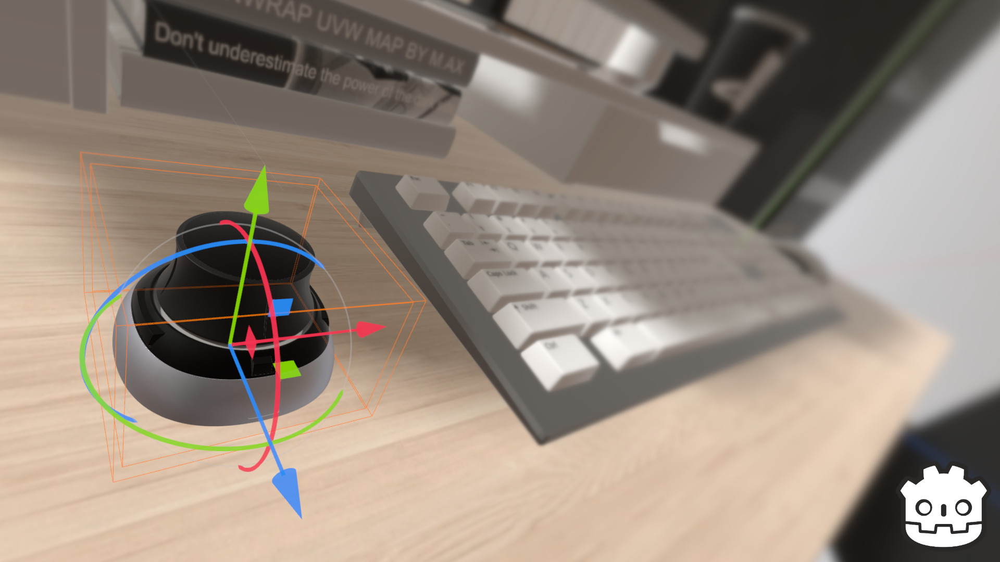

# Godot Space Mouse : Plug-In For Godot Engine
Plug-in to add support for 3Dconnexion Space Mouse and Space Navigator 3D mice input devices. Control the Godot Engine editor viewport camera with 6DOF (6 degrees of freedom). Freely translate the camera position and also rotate along the yaw, pitch, and roll axes. Currently supporting Godot 3.4.4.

## INSTALLATION

[Click Here to Download the Latest Release](https://github.com/cybereality/godot-space-mouse/releases/latest)

For manual install, download the `addons` folder from this repository and copy it into your Godot project.

## CONFIGURATION

* Place the `addons` folder, with all contents, into your Godot project root directory.
* To enable the plug-in, click `Project` `Project Settings` `Plugins` and check `Enable` next to the `Godot Space Mouse` entry.
* Use the `Space` dock in the editor to adjust speed or change to object or camera control.
* The 3Dconnexion driver is not needed on any OS. However, if you're on Windows, and have the driver installed, please first open the Godot editor, then open the 3Dconnexion app. You'll see a pop-up with the name of the Godot editor executable. Click `Advanced Settings`, then disable all navigation and zoom controls, as these can conflict with the viewport controls.
* On Linux you will need to allow HID access via udev rules. First, download the file `70-space-mouse.rules` from the `addons/spacemouse/` folder and place this file in the correct directory for your distro, such as `/etc/udev/rules.d/`. Then replug your Space Mouse hardware or run `sudo udevadm control --reload-rules && sudo udevadm trigger` to update the rules.
* For macOS, you must uninstall the 3Dconnexion drivers, as they're incompatible with the plug-in.
* Please note, a Space Mouse or Space Navigator hardware device from 3Dconnexion is required.

## BUILDING FROM SOURCE

* Download `libspacemouse.c` from the `src` folder.
* Get dependencies for [Godot GDNative](https://docs.godotengine.org/en/stable/tutorials/scripting/gdnative/gdnative_c_example.html) and [HIDAPI](https://github.com/libusb/hidapi). 

### WINDOWS

* `cl /Folibspacemouse.obj /c libspacemouse.c /nologo -EHsc -DNDEBUG /MD /I ..\godot-headers /I ..\hidapi-win\include`
* `link /nologo /dll /out:libspacemouse.dll /implib:libspacemouse.lib libspacemouse.obj /LIBPATH:..\hidapi-win\x64 hidapi.lib`

### LINUX

* `gcc -std=c11 -fPIC -c -I ../godot-headers -I /usr/include/hidapi libspacemouse.c -o libspacemouse.o`
* `gcc -shared libspacemouse.o -o libspacemouse.so -lhidapi-hidraw`

### MAC

* `gcc -std=c11 -fPIC -c -I ../godot-headers -I ../hidapi-hidapi-0.12.0/hidapi -I ../hidapi-hidapi-0.12.0/mac libspacemouse.c -o libspacemouse.o`
* `gcc -shared libspacemouse.o -o libspacemouse.dylib -L . -lhidapi.0`
* `install_name_tool -change @rpath/libhidapi.0.dylib @loader_path/libhidapi.0.dylib libspacemouse.dylib`

## LICENSE

MIT License

Copyright (c) 2022 Andres Hernandez

Permission is hereby granted, free of charge, to any person obtaining a copy
of this software and associated documentation files (the "Software"), to deal
in the Software without restriction, including without limitation the rights
to use, copy, modify, merge, publish, distribute, sublicense, and/or sell
copies of the Software, and to permit persons to whom the Software is
furnished to do so, subject to the following conditions:

The above copyright notice and this permission notice shall be included in all
copies or substantial portions of the Software.

THE SOFTWARE IS PROVIDED "AS IS", WITHOUT WARRANTY OF ANY KIND, EXPRESS OR
IMPLIED, INCLUDING BUT NOT LIMITED TO THE WARRANTIES OF MERCHANTABILITY,
FITNESS FOR A PARTICULAR PURPOSE AND NONINFRINGEMENT. IN NO EVENT SHALL THE
AUTHORS OR COPYRIGHT HOLDERS BE LIABLE FOR ANY CLAIM, DAMAGES OR OTHER
LIABILITY, WHETHER IN AN ACTION OF CONTRACT, TORT OR OTHERWISE, ARISING FROM,
OUT OF OR IN CONNECTION WITH THE SOFTWARE OR THE USE OR OTHER DEALINGS IN THE
SOFTWARE.
